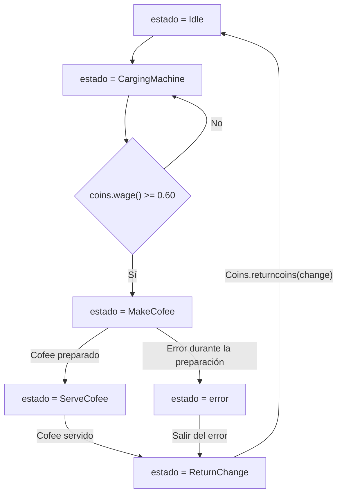
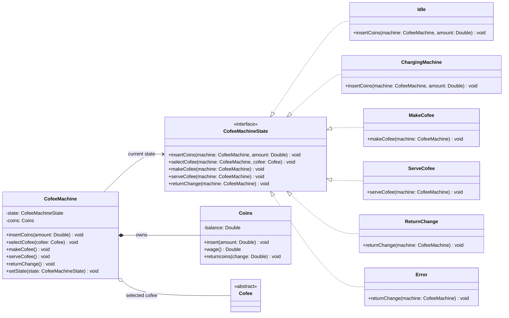
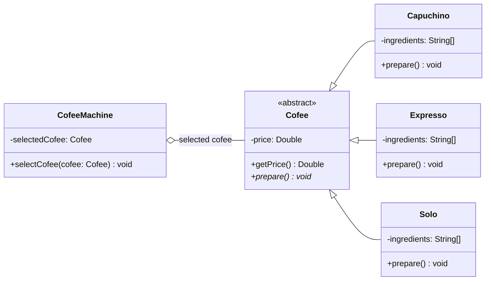

# Maquina de estados

Máquina de estados de una máquina de café. El usuario introduce monedas,
selecciona un café y la máquina avanza por los estados de preparación y entrega.

## Diagrama UML de clases

### Máquina y estados

### Tipos de café

